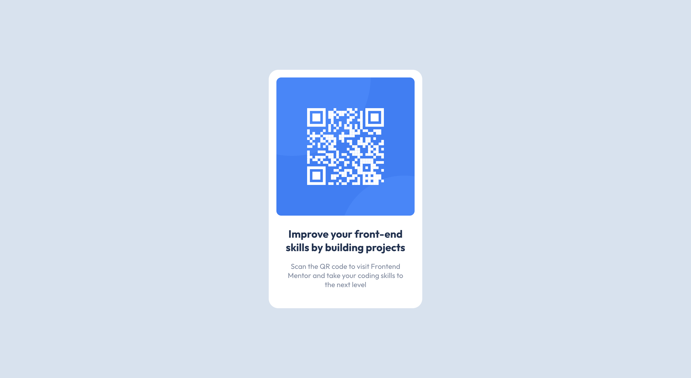

# Frontend Mentor - QR Code Component Solution

This is a solution to the [QR code component challenge on Frontend Mentor](https://www.frontendmentor.io/challenges/qr-code-component-iux_sIO_H). Frontend Mentor challenges help you improve your coding skills by building realistic projects. 

### Built with...

- React
- SASS
- Flexbox

### Desktop Screenshot

### Mobile Screenshot

